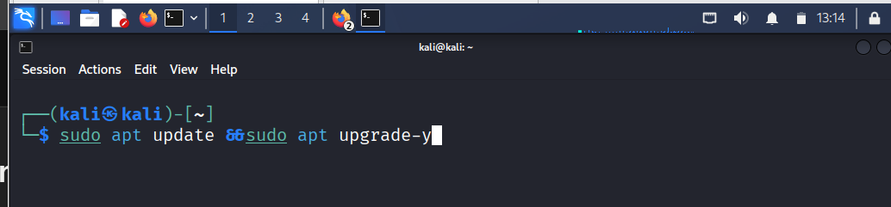

# OpenVAS

> **Developed by:** Eng. Abdllraqeeb AL Hijir
**Project Supervisor:** Eng.  Abdulrazzaq Alsamawi
> 

# Installing OpenVAS on Kali Linux

## What is OpenVAS?

OpenVAS is an open-source vulnerability scanner used for:

- Scanning networks and servers
- Discovering security vulnerabilities
- Generating security reports
- Penetration testing and security assessment

---

# 1- Install OpenVAS on Kali Linux (Recommended)

## Step 1: Update Kali Linux

```
sudo apt update &&sudo apt upgrade-y
```

---



## Step 2: Install OpenVAS

In modern Kali Linux versions, OpenVAS is included as Greenbone Vulnerability Manager (GVM).

```
sudo apt install gvm-y
```

---

## Step 3: Setup and Initialize GVM

This step downloads vulnerability feeds and configures the database.

```
sudo gvm-setup
```


---

## Step 4: Start OpenVAS Services

```
sudo gvm-start
```

After starting, you will see a URL similar to:

```
https://127.0.0.1:9392
```

Open it in your browser.

---

# Login to OpenVAS

Open browser:

```
https://127.0.0.1:9392
```

Login with:

- Username: `admin`
- Password: generated during setup

---

# Useful OpenVAS Commands

## Check GVM Status

```
sudo gvm-check-setup
```

---


## Start Services


## Stop Services

```
sudo gvm-stop
```

---

## Restart Services

```
sudo gvm-stop
sudo gvm-start
```

---

## Update Vulnerability Feeds

```
sudo greenbone-feed-sync
```

or:

```
sudo gvm-feed-update
```


# Main Sections in the Interface

## 1. Dashboard

The Dashboard shows:

- Number of scans
- Vulnerabilities found
- Severity levels
- Running tasks

### Severity Colors

- 🔴 High = Dangerous vulnerabilities
- 🟠 Medium = Moderate risk
- 🟡 Low = Small risk
- 🔵 Log = Information only


---

---

# 3. Tasks (Create Scan)

Now you create the actual scan.


---

# What Happens During Scan?

OpenVAS will:

1. Discover open ports
2. Detect services
3. Detect operating system
4. Check vulnerabilities
5. Generate report

---


**1. General Scan Information**
This section identifies what was scanned and when.
• **Task Name:** "Immediate scan of IP 192.168.207.130" – This is the target IP address that was tested for security holes.
• **Scan Time:** Indicates the start and end time of the process.
• **Scan Duration:** **1:03 h** – The scan took 1 hour and 3 minutes to complete.
• **Scan Status:** **Done** – The assessment finished successfully.
 **2. Result Summary (The Navigation Bar)**
The tabs at the top show a breakdown of what the scanner found:
• **Results (70 of 636):** The scanner identified **70 security findings** out of 636 total checks performed.
• **Hosts (1 of 1):** One specific device (the IP mentioned above) was scanned.
• **Ports (20 of 23):** The scanner checked 23 network ports and found **20 of them open** or active.
• **Applications (20 of 20):** 20 different software services or applications were detected on the host.
• **Operating Systems (1 of 1):** The scanner successfully identified the OS running on the target.
• **CVEs (36 of 36):** **36 specific Common Vulnerabilities and Exposures (CVEs)** were matched to the software found on the system.
 ****

| **Metric** | **Value** | **Description** |
| --- | --- | --- |
| **Target IP** | 192.168.207.130 | The machine being tested. |
| **Vulnerabilities** | 70 Results | Total issues/info gathered. |
| **Known Exploits** | 36 CVEs | Number of documented security flaws found. |
| **Open Ports** | 20 | Number of entry points detected. |


# Why Open Ports Matter

Every open port may expose:

- Services
- Applications
- Weak configurations

Attackers often target:

- Misconfigured services
- Outdated software
- Weak authentication

---

# Common Ports You May See

| Port | Service | Purpose |
| --- | --- | --- |
| 21 | FTP | File Transfer |
| 22 | SSH | Remote Access |
| 23 | Telnet | Remote Login |
| 25 | SMTP | Email |
| 80 | HTTP | Web Server |
| 443 | HTTPS | Secure Web |
| 3306 | MySQL | Database |
| 3389 | RDP | Remote Desktop |


# Applications Section

```
Applications (20 of 20)
```

OpenVAS identified running applications/services.

Examples:

- Apache
- Nginx
- MySQL
- OpenSSH
- Samba

This helps security analysts:

- Detect outdated software
- Identify vulnerable versions
- Map attack surfaces


# CVEs Section

```
CVEs (36 of 36)
```

## What is a CVE?

CVE stands for:

```
Common Vulnerabilities and Exposures
```

A CVE is a publicly documented security vulnerability.

Example:

```
CVE-2021-44228
```

This CVE refers to the Log4Shell vulnerability.

---

# Why CVEs Are Important

CVEs help security teams:

- Track vulnerabilities
- Research exploitability
- Apply security patches
- Prioritize risks

Each CVE contains:

- Severity score
- Technical description
- Affected software
- Mitigation steps

---

# Severity Levels Explained

| Severity | Meaning |
| --- | --- |
| Critical | Immediate danger |
| High | Serious vulnerability |
| Medium | Moderate risk |
| Low | Minor issue |
| Log | Informational only |


# Report PDF Explanation

The PDF report contains:

- Executive summary
- Technical findings
- Severity analysis
- Vulnerability details
- Recommendations

This report is commonly used in:

- Security assessments
- Academic projects
- Penetration testing reports
- Compliance documentation

